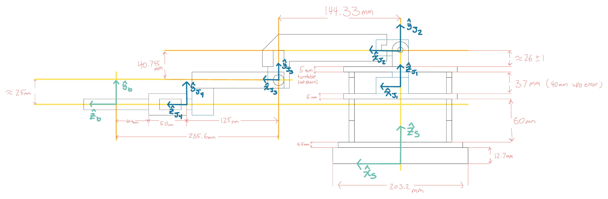
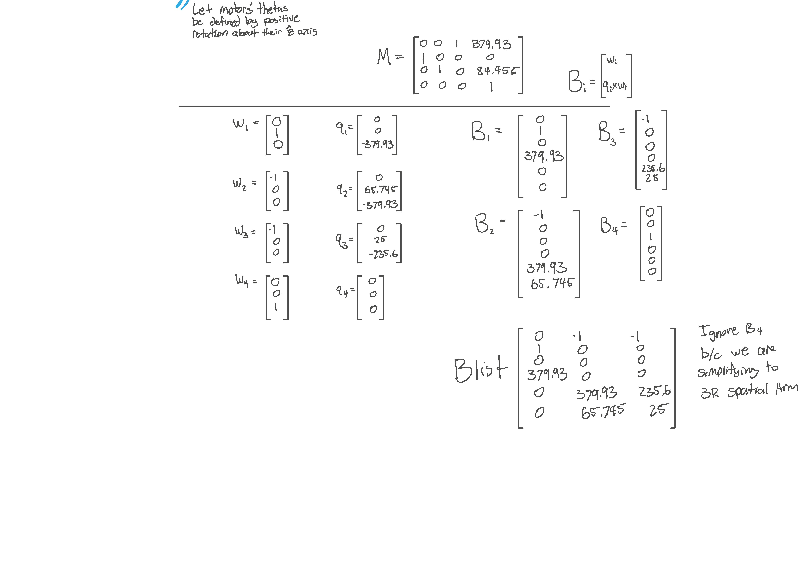
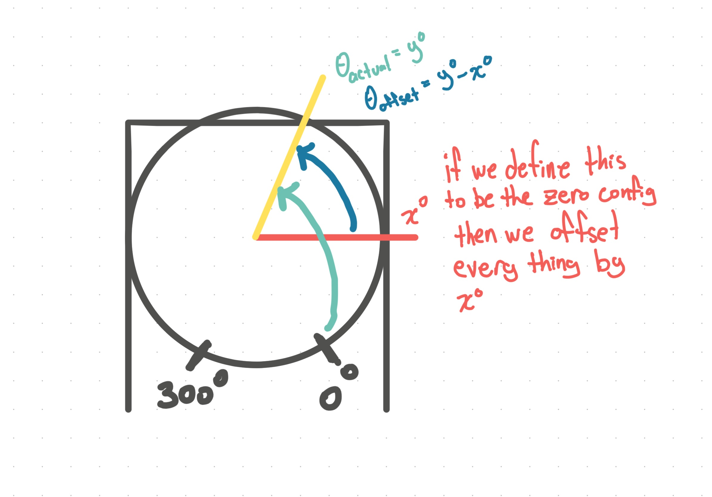
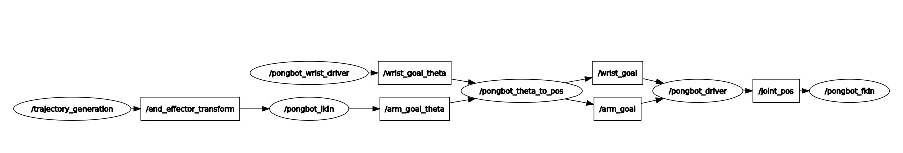
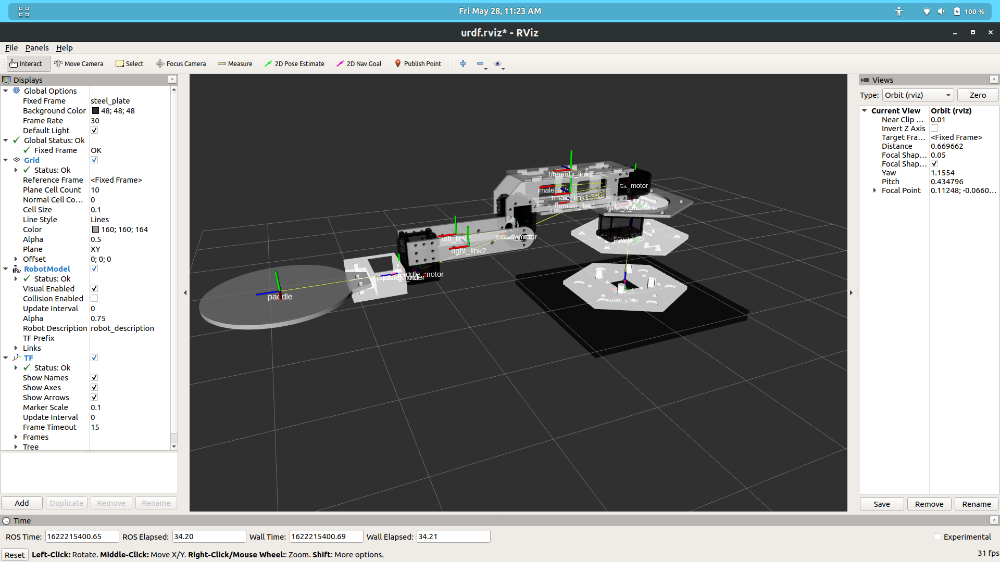
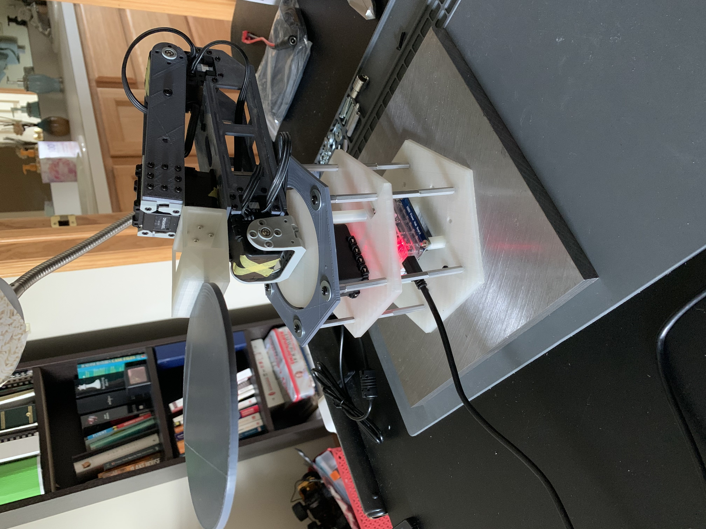
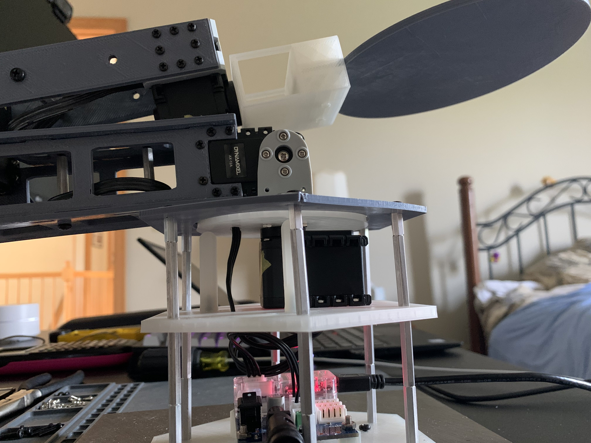

# pongBot
Progress on building a robot that can bounce a ping-pong ball forever...maybe more?

- [Methods](#Methods)
  - [Kinematics](#Kinematics)
  - [Theta offset](#Theta-offset)
  - [ROS](#ROS)
  - [Simulation](#Simulation)
    - [URDF](#URDF)
- [Build Progress](#Build-Progress)
  - [VERSION1](#VERSION1)
    - [Controller-Agent Unit](#Controller-Agent-Unit)
    - [Base](#Base)
    - [Link1](#Link-1)
    - [Link2](#Link-2)
    - [End-Effector](#End-Effector)
  - [VERSION2](#VERSION2)
- [Problems Encountered](#Problems-Encountered!)
- [TODO](#TODO)

# Methods

## Kinematics

## Theta offset

## ROS

## Simulation

### URDF

# Build Progress
## VERSION1
### Controller-Agent Unit
- There are two of these units, one is the controller and one is the agent. The agent will always mimic the pan/tilt position of the controller   

### Base
- There are 3 layers to the base
  - The first layer houses the U2D2 controller/PC interface
  - The second layer holds the pan motor which has the turntable attached to it and a spacer between for level
  - The third layer hodls the tilt motor which is a combination of the turntable and the rim
- Each of the layers are attached by standoffs
- I have plans to attach a steel plate to the bottom of the base such that the arm does not backflip off of a single rotation

. | . | .
:-:|:-:|:-:
||

### Link 1
- The first link is 4 plates that attach to the tilt motor. The front and back plates are linked by a standoff for support. The end of the link holds the second arm joint.

.|.|.|.
:-:|:-:|:-:|:-:
 |  |  | 

### Link 2
- The second link is a combination of 2 side panels joined by a standoff for support. The end of link2 holds the end effector

.|.|.|.
:-:|:-:|:-:|:-:
 |  |  | 

### End Effector
-  The end effector is a two piece 3-D printed paddle that attaches to a motor for angle control

## VERSION2
- The clear parts represents the reprints in PLA. I made them slightly thicker to reduce the wobble problem. In between the 
turntable and base2, I also put support beams. These were intended to have ball bearings on top but frankly I did not have
any on me at the time. I discovered, however, that the plastics are smooth enough to support and slide with minimal frictional resistance
- Lastly I was able to get a half-inch thick steel plate (thanks dad) to bolt the arm's base to. I drilled and tapped holes into it so 
now the arm will not do backflips everytime I attempt to move the end-effector

.|.
:-:|:-:
 | 

# Problems Encountered!
- WOBBLE
  - There is a lot of wobble in the first fully assembled test run. The turntable and second-level base (base2) are the source of a lot of instability in the system. The shaft of the motor is much smaller than the diameter of the turntable which causes wobbling. Additionally, base2 has a "trampoline" effect
  - Going to double the thickness of base2 and the turntable, and also look into designing ball-bearing support beams for the table. Will likely shift from ABS to PLA filament for these because PLA has higher rigidity 
- LIMITED DOF
  - There is not 6DOF which makes trajectory generation difficult. We are unable to easily define the workspace of the arm and therefore cannot pick arbitrary configurations for the arm to follow. This motivates the investigation into using Reinforcement Learning to allow complex behavior
  - Will spend time getting the robot in simulation to use as a testbed for AI controllers

# TODO
- [x] Find cool project
- [x] Design crude sketch, specifying DOF, # of links, actuators, and end effector
  - 4 DOF, 2 links, 4 actuators, and a paddle as the end effector
- [x] Figure out and purchase the actuators necessary to achieve the desired effect
  - Dynamixel AX-12a
- [x] 3D model necessary links, base, and other parts to have a 3D printable prototype
  - Will have redesigns as the project evolves
  - First was a simple pan/tilt setup
  - Next is to combine motors into a single arm
- [x] Assemble and wire parts together
- [x] Write driver code to be able to control the robot in a controller/agent configuration
  -  See the "controller_agent" package in the catkin_ws
- [x] Combine all motors into a single robot arm
  - [x] DETOUR: Redesign turntable and base2 in PLA to fix wobble. Also design ball-bearing support beams
- [x] Figure out coordinate frame transformations of each necessary part (base, joints, end effector)
- [ ] Get robot in simulation
  - [x] URDF
  - [x] Rviz
  - [ ] Gazebo
- [ ] Test Reinforcement Learning controls on simulation
- [ ] Write code to do a "show floor" run of all of the robots capabilities
- [ ] Use OpenCV to identify and get pose estimation of a ping pong ball
- [ ] Figure out coordinate frame transforamtions of camera to robot
- [ ] Be able to have robot autonomously move its end effector to a static ping-pong ball identified by the overhead camera
- [ ] Use physics equations and magic to calculate the force and angle necessary to send the ping-pong ball vertically from a static position of resting on the paddle/end effector
- [ ] Use said magic to move the end effector to the location of the ball coming down from the initial hit and strike the ball in a controlled manner such that the ball will land somewhere within the robot's range of motion
- [ ] Repeat previous step 
